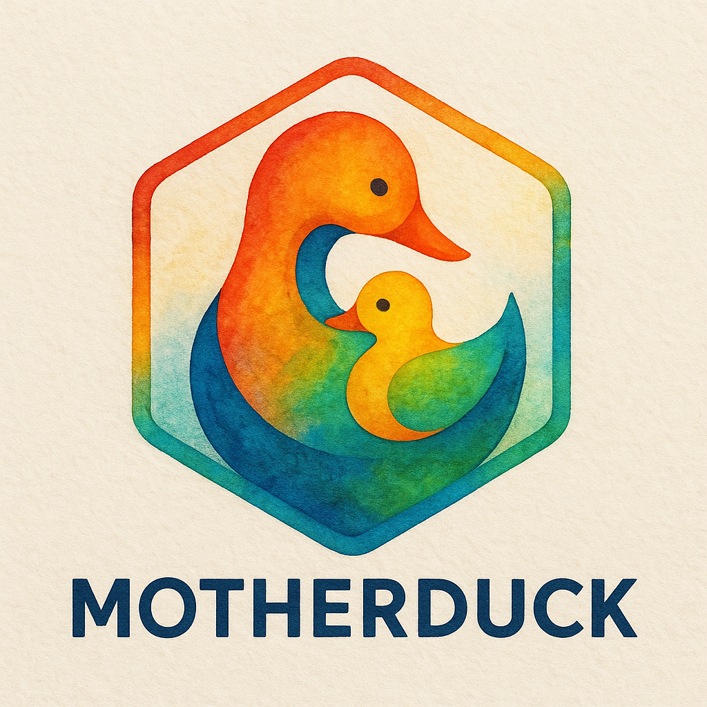

 <!-- badges: start -->
    <!-- badges: start -->
  [](https://CRAN.R-project.org/package=motherduck)
  [](https://mybinder.org/v2/gh/usrbinr/motherduck/HEAD)
  [](https://cran.r-project.org/package=motherduck)
  <!-- badges: end -->

    

## Overview

This is a collection of utilities to help with the management, administration and navigation of [duckdb](https://duckdb.org/) database either locally on your computer or in the cloud via [motherduck](https://motherduck.com/)

Database management is incredibly easy in R with fantastic packages such as [DBI](https://dbplyr.tidyverse.org/) and [dbplyr](https://dbplyr.tidyverse.org/), however some databases have specific extensions or utilities that are aren't readily accessible via these packages

{motherduck} package simplifies these common database administration task with easy to understand syntax. {motherduck} is built upon [DBI](https://dbplyr.tidyverse.org/) and returns a lazy DBI object so that you can further fully integrate your data with [dbplyr](https://dbplyr.tidyverse.org/)


## What do I need to use this?

-   [duckdb](https://duckdb.org/) R package installed on your computer
-   A [motherduck](https://motherduck.com/) account
-   A motherduck access token which you you can be saved to your R environment file with `usethis::edit_r_environ()`


```{r}
#| label: connection-example
#| echo: true
#| eval: false
#| warning: true
#| message: true
#| include: true


con_md <- connect_to_motherduck("MOTHERDUCK_TOKEN")

```

